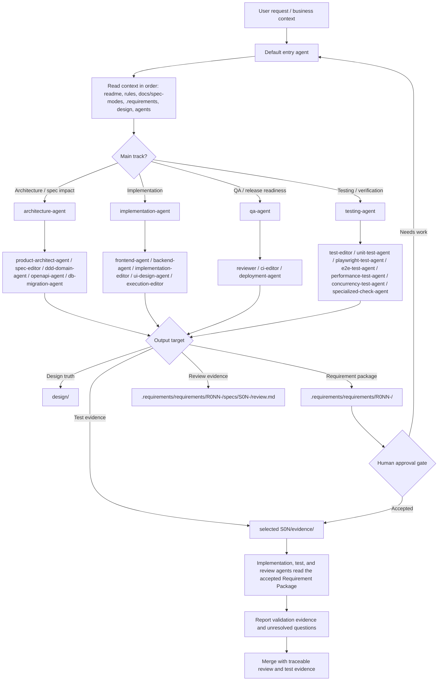
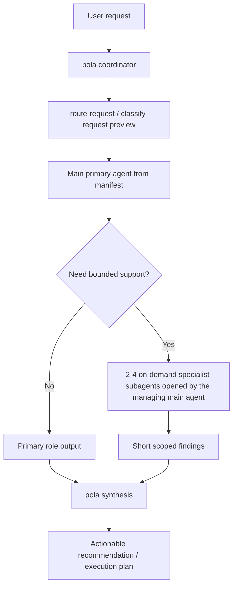

# Agents

This directory defines local agent routing, role contracts, and scoped skill loading for SpecOS.

GoalSpec v2 role prompts live under `.agents/roles/`.

## How To Use

- Start with `manifest.yaml` to choose the correct agent role.
- Resolve `role_prompt` paths relative to `.agents/`; resolve `canonical`, `skills[*].path`, and `context_includes` from the repository root unless noted otherwise.
- After selecting a role, load its registered local and canonical prompts directly.
- Use `roles/` for local role-specific responsibilities, inputs, outputs, and guardrails.
- Keep role outputs aligned with canonical assets under `ai/agents/`.
- Prefer assigning one role per bounded task.

## Main Agent Selection

SpecOS uses a five-tier top structure: one coordinator plus four user-routable main agents (`tier: main`). All other roles are `tier: specialist` and are opened on demand as subagents by their `managed_by` main agent.

- Coordinator (not dispatchable): `pola` — request intake, routing preview, report merge
- Architecture and spec impact: `architecture-agent`
- Implementation execution: `implementation-agent`
- Independent verification: `testing-agent`
- QA acceptance, release, and deployment readiness: `qa-agent`

Specialist agents grouped by their managing main agent:

- `architecture-agent` manages:
  - Idea intake and accepted PRDs: `product-architect-agent`
  - Spec normalization: `spec-editor`
  - Domain boundaries and invariants: `ddd-domain-agent`
  - API contract generation: `openapi-agent`
  - Database and migration planning: `db-migration-agent`
- `implementation-agent` manages:
  - Frontend delivery orchestration: `frontend-agent`
  - Backend delivery orchestration: `backend-agent`
  - Focused spec-driven code edits: `implementation-editor`
  - Product UI design: `ui-design-agent`
  - Local scripts and workflow wiring: `execution-editor`
- `testing-agent` manages:
  - Test structure, coverage, API scenario tests, and Bruno assets: `test-editor`
  - Unit coverage analysis: `unit-test-agent`
  - Browser behavior and UI state verification: `playwright-test-agent`
  - End-to-end business journeys: `e2e-test-agent`
  - Performance and latency evidence: `performance-test-agent`
  - Concurrency and invariant evidence: `concurrency-test-agent`
  - Specialized checks: `specialized-check-agent`
- `qa-agent` manages:
  - Cross-rule review: `reviewer`
  - CI checks and release gates: `ci-editor`
  - Deployment readiness evidence: `deployment-agent`

## Dispatch Flow

The default entry agent receives the user request, classifies the work, then routes bounded issues to the narrowest matching role from `manifest.yaml`. This is a routing contract for agent teams; the current repository stores the contract and role prompts, while concrete runtime dispatch is implemented by the host agent system or future workflow runner.

For a deterministic local route preview, run:

```bash
node packages/cli/dist/main.js route-request --request "<需求文本>"
```

The command returns `requestKind`, `workTypes`, `primaryAgent`, `supportingAgents`, required rules, role-bound skills, prompt assembly load order, and the next lifecycle step. It does not execute the selected agents; it makes the GoalSpec v2 routing decision explicit before intake, implementation, testing, review, or release work starts.

For host runtimes that only need subagent dispatch payloads, use:

```bash
node packages/cli/dist/main.js route-request --request "<需求文本>" --format dispatch-json
```

That mode returns only `specialistDispatchPlan.issues[*].dispatchPromptEnvelope`.

For host runtimes that only need the main agent payload, use:

```bash
node packages/cli/dist/main.js route-request --request "<需求文本>" --format primary-json
```

That mode returns only `executionPlan.primaryDispatchPromptEnvelope`.

For host runtimes that want the full execution object directly, use:

```bash
node packages/cli/dist/main.js route-request --request "<需求文本>" --format execution-plan-json
```

That mode returns only `executionPlan`.

To validate a saved route payload before dispatching it into a host runtime, use:

```bash
node packages/cli/dist/main.js validate-route-output --file ./tmp/route.json --format dispatch-json
```

This reuses `validateRouteRequestOutput(...)` from `@specos/core`, so CLI and host-side consumers can enforce the same shape checks for `full`, `dispatch-json`, `primary-json`, and `execution-plan-json`.

To validate a saved runtime execution plan instead of a preview payload, use:

```bash
node packages/cli/dist/main.js validate-execution-plan --file ./tmp/execution-plan.json
```

This reuses `validateExecutionPlanOutput(...)` from `@specos/core`.

If another host surface needs the same projections without shelling out to the CLI, use `buildValidatedRouteRequestOutput(...)` from `@specos/core` when you want a preview payload that has already passed the same projection checks as the CLI. For stable consumer-side validation, use `buildRouteRequestOutputSchema(...)`, `buildHostPromptAssemblySchema(...)`, `buildDispatchPromptEnvelopeSchema(...)`, `buildPrimaryDispatchPromptEnvelopeSchema(...)`, `buildSpecialistDispatchPromptEnvelopeSchema(...)`, `buildExecutionPlanOutputSchema(...)`, `validateRouteRequestOutput(...)`, `validateExecutionPlanOutput(...)`, `validateHostPromptAssembly(...)`, `validateAgentExecutionPlan(...)`, `validateDispatchPromptEnvelope(...)`, `validatePrimaryDispatchPromptEnvelope(...)`, or `validateSpecialistDispatchPromptEnvelope(...)`. All schema helpers return the shared `ArtifactShapeSchema` shape, with an `artifact` discriminator and the relevant top-level field lists.

For host runtimes that need a reusable execution object instead of a preview, use `buildValidatedAgentExecutionPlan(...)` from `@specos/core`. It wraps `buildAgentExecutionPlan(...)`, then validates the resulting route, prompt assembly, and dispatch envelopes before the host starts any agent. Use `buildSpecialistDispatchPlan(...)` when the host already has an execution plan and only needs 2 to 4 dispatchable specialist issues. Each dispatch task now includes `dispatchPromptEnvelope`, which is the host-ready prompt payload for a subagent. Use `buildHostPromptAssembly(...)` as the lower-level helper when the host already has a selected role set and only needs prompt/context assembly.

## Nested Dispatch

`pola` is the coordinator for multi-agent work. The coordinator owns request intake, route preview, task boundaries, report merge, false-positive filtering, and the final consolidated recommendation.

Nested dispatch follows this contract:

- The entry agent classifies the request and chooses a main `primaryAgent` from `.agents/manifest.yaml`.
- The primary agent receives only its declared role prompt, canonical prompt, skills, and context includes.
- The primary agent may propose bounded specialist-agent issues when the work crosses ownership boundaries.
- Supporting agents must also be registered in `.agents/manifest.yaml`; do not invent ad-hoc roles inside a task.
- For architecture, domain-boundary, and cross-surface risk work, use `architecture-agent` as the primary role. It manages `product-architect-agent`, `spec-editor`, `ddd-domain-agent`, `openapi-agent`, and `db-migration-agent`, and may ask for focused input from other domains through `pola`.
- For implementation work, use `implementation-agent` as the primary role. It manages `frontend-agent`, `backend-agent`, `implementation-editor`, `ui-design-agent`, and `execution-editor`.
- For independent verification, use `testing-agent` as the primary role. It manages `test-editor`, `unit-test-agent`, `playwright-test-agent`, `e2e-test-agent`, `performance-test-agent`, `concurrency-test-agent`, and `specialized-check-agent`. `playwright-test-agent` belongs here as a browser/UI verification specialist, not under frontend implementation.
- For QA acceptance, release, and deployment readiness, use `qa-agent` as the primary role. It manages `reviewer`, `ci-editor`, and `deployment-agent`.
- Specialist issues carry `managedBy` and `activation: "on-demand"`: the managing main agent opens a specialist subagent only when the bounded question requires it, instead of pre-dispatching every registered specialist.
- Runtime execution is outside this directory. Host systems may run 2 to 4 subagents in parallel, but this repository only defines the routing contract, prompt assembly, and expected outputs.
- The final output should be one actionable synthesis from `pola`, not a concatenation of every subagent report.

## Canonical Lifecycle

SpecOS now routes work through this model:

```text
PRD Workspace -> Approved Child Spec -> Approved Test Design -> Issues -> Implementation / Independent Verification -> Evidence/Review -> QA Acceptance -> Ship
```

Canonical storage targets:

- `docs/spec-modes/GoalSpec/`: Agent-Native SDLC standard
- `.requirements/`: one requirement = one PRD Workspace under `.requirements/requirements/R0NN-<slug>/`
  - root `prd.md`, `index.yaml`, and `acceptance.md`: product truth, child summary, PRD acceptance
  - `specs/S0N-<slug>/`: independently deliverable Spec Package with `spec.md`, `test.md`, `issues/ISSUE-*.md`, `review.md`, `acceptance.md`, and `evidence/`
- `specs/S0N-<slug>/evidence/`: indexed plans, schedules, runs, gates, and artifacts
- `design/`: stable platform or system design

A useful subagent task should state:

- target role from `manifest.yaml`
- source spec, draft, rule, or current context
- owned files or surfaces to inspect
- exact question to answer
- expected short output shape
- known non-goals and forbidden context





## Prompt Assembly

When a role is selected, assemble prompt context in this order:

1. Root `AGENTS.md`
2. `.codex/instructions.md`
3. Selected role metadata from `manifest.yaml`
4. Selected `role_prompt`
5. Selected canonical file under `ai/agents/`
6. Selected declared skills
7. Selected required rules and context includes

When the active delivery state changes task boundaries, read `docs/spec-modes/GoalSpec/` and the active Requirement Workspace before loading broader context.

## Prompt Sources

- Local role prompts: `.agents/roles/<role>.md`
- Canonical prompts: `ai/agents/<role>.md`

## Project Context Placement

Stable platform and system design belongs under `design/`. Each new requirement lives in a PRD Workspace under `.requirements/requirements/R0NN-<slug>/`, with child Spec Packages under `specs/S0N-<slug>/`.

Role prompts should reference those surfaces through `.agents/manifest.yaml` `context_includes` instead of duplicating accepted project facts inside `.agents/roles/` or `ai/agents/`.

## Skill Loading Rules

- Skills are opt-in per role and must be declared in `manifest.yaml`.
- Do not preload repository-local or external skills for unrelated roles.
- If a role has `skills: []`, run it with role docs and rules only.
- For cross-domain work, switch agents or split the task instead of broadening one agent's context.

## Shared Rules

- Every role must cite the current design doc, feature spec, draft, rule, or workflow it is using.
- Every output must include open questions when information is missing.
- Role work should be narrow, reviewable, and safe to compose with other agents.
- Semantic changes that affect specs, rules, agents, skills, workflows, tests, checks, or release evidence must include a `Sync Handoff` following `ai/workflows/sync-handoff-gateway.md` before CI, PR, release, or promotion claims.
- `pola` owns the final sync judgment and should reject false-positive neighbor updates instead of forwarding every local subagent concern.
