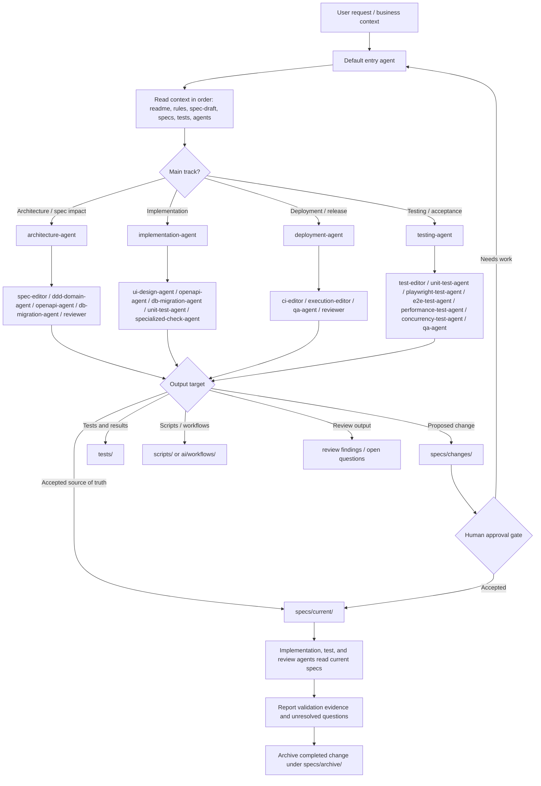
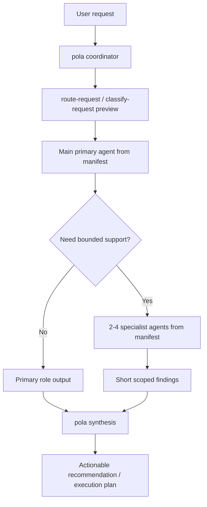

# Agents

This directory defines local agent routing, role contracts, and scoped skill loading for SpecOS.

## How To Use

- Start with `manifest.yaml` to choose the correct agent role.
- Resolve `role_prompt` paths relative to `.agents/`; resolve `canonical`, `skills[*].path`, and `context_includes` from the repository root unless noted otherwise.
- After selecting a role, only load that role's declared `role_prompt`, `canonical`, `skills`, and `context_includes`.
- Use `roles/` for local role-specific responsibilities, inputs, outputs, and guardrails.
- Keep role outputs aligned with canonical assets under `ai/agents/`.
- Prefer assigning one role per bounded task.

## Main Agent Selection

Use main agents for phase ownership and user-facing routing:

- Architecture and spec impact: `architecture-agent`
- Implementation execution: `implementation-agent`
- Deployment, CI, and release readiness: `deployment-agent`
- Independent verification and acceptance: `testing-agent`

Specialist agents remain registered roles, but they should normally be delegated by a main agent instead of becoming the default user-facing entrypoint:

- Spec normalization: `spec-editor`
- Domain boundaries and invariants: `ddd-domain-agent`
- API contract generation: `openapi-agent`
- Database and migration planning: `db-migration-agent`
- Product UI design: `ui-design-agent`
- Test structure and coverage: `test-editor`
- Unit coverage analysis: `unit-test-agent`
- API scenario tests and Bruno assets: `test-editor`
- Browser behavior and UI state verification: `playwright-test-agent`
- End-to-end business journeys: `e2e-test-agent`
- Performance and latency evidence: `performance-test-agent`
- Concurrency and invariant evidence: `concurrency-test-agent`
- CI checks and release gates: `ci-editor`
- Local scripts and workflow wiring: `execution-editor`
- Final quality acceptance: `qa-agent`
- Cross-rule review: `reviewer`

## Dispatch Flow

The default entry agent receives the user request, classifies the work, then routes bounded tasks to the narrowest matching role from `manifest.yaml`. This is a routing contract for agent teams; the current repository stores the contract and role prompts, while concrete runtime dispatch is implemented by the host agent system or future workflow runner.

For a deterministic local route preview, run:

```bash
node packages/cli/dist/main.js route-request --request "<需求文本>"
```

The command returns `requestKind`, `workTypes`, `primaryAgent`, `supportingAgents`, required rules, role-bound skills, and the next lifecycle step. It does not execute the selected agents; it makes the routing decision explicit before intake, implementation, testing, review, or release work starts.

## Nested Dispatch

`pola` is the coordinator for multi-agent work. The coordinator owns request intake, route preview, task boundaries, report merge, false-positive filtering, and the final consolidated recommendation.

Nested dispatch follows this contract:

- The entry agent classifies the request and chooses a main `primaryAgent` from `.agents/manifest.yaml`.
- The primary agent receives only its declared role prompt, canonical prompt, skills, and context includes.
- The primary agent may propose bounded specialist-agent tasks when the work crosses ownership boundaries.
- Supporting agents must also be registered in `.agents/manifest.yaml`; do not invent ad-hoc roles inside a task.
- For architecture, domain-boundary, and cross-surface risk work, use `architecture-agent` as the primary role. It may ask for focused input from `spec-editor`, `ddd-domain-agent`, `openapi-agent`, `db-migration-agent`, `ui-design-agent`, `test-editor`, `performance-test-agent`, `concurrency-test-agent`, `ci-editor`, `reviewer`, or `qa-agent` when those surfaces are involved.
- For implementation work, use `implementation-agent` as the primary role. It may delegate to existing specialists such as `ui-design-agent`, `openapi-agent`, `db-migration-agent`, `unit-test-agent`, or `specialized-check-agent`. Future frontend implementation specialists for state management, component rendering, interactions, styling, and API integration must be added to `.agents/manifest.yaml` before use.
- For deployment and release work, use `deployment-agent` as the primary role. It may delegate to `ci-editor`, `execution-editor`, `qa-agent`, or `reviewer`.
- For independent verification, use `testing-agent` as the primary role. `playwright-test-agent` belongs here as a browser/UI verification specialist, not under frontend implementation.
- Runtime execution is outside this directory. Host systems may run 2 to 4 subagents in parallel, but this repository only defines the routing contract, prompt assembly, and expected outputs.
- The final output should be one actionable synthesis from `pola`, not a concatenation of every subagent report.

A useful subagent task should state:

- target role from `manifest.yaml`
- source spec, draft, rule, or current context
- owned files or surfaces to inspect
- exact question to answer
- expected short output shape
- known non-goals and forbidden context





## Prompt Assembly

When a role is selected, assemble prompt context in this order:

1. Root `AGENTS.md`
2. `.codex/instructions.md`
3. Selected role metadata from `manifest.yaml`
4. Selected `role_prompt`
5. Selected canonical file under `ai/agents/`
6. Selected declared skills
7. Selected required rules and context includes

## Project Context Placement

Stable project background, architecture facts, and domain language belong under `specs/current/`:

- `specs/current/project-context.md`
- `specs/current/architecture-context.md`
- `specs/current/domain-context.md`

Role prompts should reference these files through `.agents/manifest.yaml` `context_includes` instead of duplicating accepted project facts inside `.agents/roles/` or `ai/agents/`.

## Skill Loading Rules

- Skills are opt-in per role and must be declared in `manifest.yaml`.
- Do not preload repository-local or external skills for unrelated roles.
- If a role has `skills: []`, run it with role docs and rules only.
- For cross-domain work, switch agents or split the task instead of broadening one agent's context.

## Shared Rules

- Every role must cite the current spec, proposed change, draft, rule, or workflow it is using.
- Every output must include open questions when information is missing.
- Role work should be narrow, reviewable, and safe to compose with other agents.
- Semantic changes that affect specs, rules, agents, skills, workflows, tests, checks, or release evidence must include a `Sync Handoff` following `ai/workflows/sync-handoff-gateway.md` before CI, PR, release, or promotion claims.
- `pola` owns the final sync judgment and should reject false-positive neighbor updates instead of forwarding every local subagent concern.
