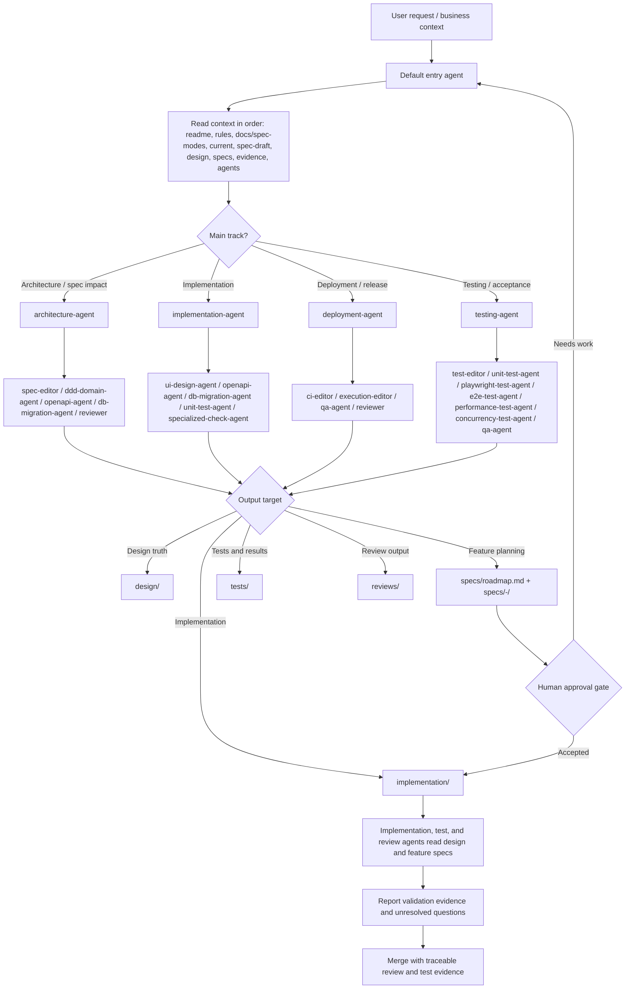
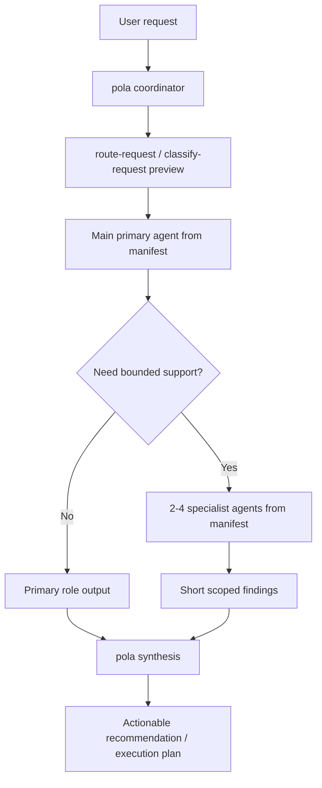

# Agents

This directory defines local agent routing, role contracts, and scoped skill loading for SpecOS.

Shared role prompts live under `.agents/roles/`.

Mode-specific differences live under `.agents/modes/<mode>/roles/`.

## How To Use

- Start with `manifest.yaml` to choose the correct agent role.
- Resolve `role_prompt` paths relative to `.agents/`; resolve `canonical`, `skills[*].path`, and `context_includes` from the repository root unless noted otherwise.
- After selecting a role, load the shared prompt first, then the selected mode overlay when one exists.
- Use `roles/` for local role-specific responsibilities, inputs, outputs, and guardrails.
- Keep role outputs aligned with canonical assets under `ai/agents/`.
- Prefer assigning one role per bounded task.

## Main Agent Selection

Use main agents for phase ownership and user-facing routing:

- Architecture and spec impact: `architecture-agent`
- Implementation execution: `implementation-agent`
- Deployment, CI, and release readiness: `deployment-agent`
- Independent verification and acceptance: `testing-agent`

Specialist agents remain registered roles, but they should normally be delegated by a main agent instead of becoming the default user-facing entrypoint:

- Spec normalization: `spec-editor`
- Domain boundaries and invariants: `ddd-domain-agent`
- API contract generation: `openapi-agent`
- Database and migration planning: `db-migration-agent`
- Product UI design: `ui-design-agent`
- Standalone Product AI OS CLI GUI: `cli-gui-agent`
- Test structure and coverage: `test-editor`
- Unit coverage analysis: `unit-test-agent`
- API scenario tests and Bruno assets: `test-editor`
- Browser behavior and UI state verification: `playwright-test-agent`
- End-to-end business journeys: `e2e-test-agent`
- Performance and latency evidence: `performance-test-agent`
- Concurrency and invariant evidence: `concurrency-test-agent`
- CI checks and release gates: `ci-editor`
- Local scripts and workflow wiring: `execution-editor`
- Final quality acceptance: `qa-agent`
- Cross-rule review: `reviewer`

## Dispatch Flow

The default entry agent receives the user request, classifies the work, then routes bounded tasks to the narrowest matching role from `manifest.yaml`. This is a routing contract for agent teams; the current repository stores the contract and role prompts, while concrete runtime dispatch is implemented by the host agent system or future workflow runner.

For a deterministic local route preview, run:

```bash
node packages/cli/dist/main.js route-request --request "<需求文本>"
```

The command returns `projectMode`, `requestKind`, `workTypes`, `primaryAgent`, `supportingAgents`, required rules, role-bound skills, prompt assembly load order, and the next lifecycle step. It resolves `projectMode` from `.specos/manifest.yaml` first, then points at the selected mode overlay manifest and per-role overlay prompt paths. It does not execute the selected agents; it makes the routing decision explicit before intake, implementation, testing, review, or release work starts.

For host runtimes that only need subagent dispatch payloads, use:

```bash
node packages/cli/dist/main.js route-request --request "<需求文本>" --format dispatch-json
```

That mode returns only `specialistDispatchPlan.tasks[*].dispatchPromptEnvelope`.

For host runtimes that only need the main agent payload, use:

```bash
node packages/cli/dist/main.js route-request --request "<需求文本>" --format primary-json
```

That mode returns only `executionPlan.primaryDispatchPromptEnvelope`.

For host runtimes that want the full execution object directly, use:

```bash
node packages/cli/dist/main.js route-request --request "<需求文本>" --format execution-plan-json
```

That mode returns only `executionPlan`.

To validate a saved route payload before dispatching it into a host runtime, use:

```bash
node packages/cli/dist/main.js validate-route-output --file ./tmp/route.json --format dispatch-json
```

This reuses `validateRouteRequestOutput(...)` from `@specos/core`, so CLI and host-side consumers can enforce the same shape checks for `full`, `dispatch-json`, `primary-json`, and `execution-plan-json`.

To validate a saved runtime execution plan instead of a preview payload, use:

```bash
node packages/cli/dist/main.js validate-execution-plan --file ./tmp/execution-plan.json
```

This reuses `validateExecutionPlanOutput(...)` from `@specos/core`.

If another host surface needs the same projections without shelling out to the CLI, use `buildValidatedRouteRequestOutput(...)` from `@specos/core` when you want a preview payload that has already passed the same projection checks as the CLI. For stable consumer-side validation, use `buildRouteRequestOutputSchema(...)`, `buildHostPromptAssemblySchema(...)`, `buildDispatchPromptEnvelopeSchema(...)`, `buildPrimaryDispatchPromptEnvelopeSchema(...)`, `buildSpecialistDispatchPromptEnvelopeSchema(...)`, `buildExecutionPlanOutputSchema(...)`, `validateRouteRequestOutput(...)`, `validateExecutionPlanOutput(...)`, `validateHostPromptAssembly(...)`, `validateAgentExecutionPlan(...)`, `validateDispatchPromptEnvelope(...)`, `validatePrimaryDispatchPromptEnvelope(...)`, or `validateSpecialistDispatchPromptEnvelope(...)`. All schema helpers return the shared `ArtifactShapeSchema` shape, with an `artifact` discriminator and the relevant top-level field lists.

For host runtimes that need a reusable execution object instead of a preview, use `buildValidatedAgentExecutionPlan(...)` from `@specos/core`. It wraps `buildAgentExecutionPlan(...)`, then validates the resulting route, prompt assembly, and dispatch envelopes before the host starts any agent. Use `buildSpecialistDispatchPlan(...)` when the host already has an execution plan and only needs 2 to 4 dispatchable specialist tasks. Each dispatch task now includes `dispatchPromptEnvelope`, which is the host-ready prompt payload for a subagent. Use `buildHostPromptAssembly(...)` as the lower-level helper when the host already has a selected role set and only needs prompt/context assembly.

## Nested Dispatch

`pola` is the coordinator for multi-agent work. The coordinator owns request intake, route preview, task boundaries, report merge, false-positive filtering, and the final consolidated recommendation.

Nested dispatch follows this contract:

- The entry agent classifies the request and chooses a main `primaryAgent` from `.agents/manifest.yaml`.
- The primary agent receives only its declared role prompt, canonical prompt, skills, and context includes.
- The primary agent may propose bounded specialist-agent tasks when the work crosses ownership boundaries.
- Supporting agents must also be registered in `.agents/manifest.yaml`; do not invent ad-hoc roles inside a task.
- For architecture, domain-boundary, and cross-surface risk work, use `architecture-agent` as the primary role. It may ask for focused input from `spec-editor`, `ddd-domain-agent`, `openapi-agent`, `db-migration-agent`, `ui-design-agent`, `test-editor`, `performance-test-agent`, `concurrency-test-agent`, `ci-editor`, `reviewer`, or `qa-agent` when those surfaces are involved.
- For implementation work, use `implementation-agent` as the primary role. It may delegate to existing specialists such as `ui-design-agent`, `openapi-agent`, `db-migration-agent`, `unit-test-agent`, or `specialized-check-agent`. Future frontend implementation specialists for state management, component rendering, interactions, styling, and API integration must be added to `.agents/manifest.yaml` before use.
- For deployment and release work, use `deployment-agent` as the primary role. It may delegate to `ci-editor`, `execution-editor`, `qa-agent`, or `reviewer`.
- For independent verification, use `testing-agent` as the primary role. `playwright-test-agent` belongs here as a browser/UI verification specialist, not under frontend implementation.
- Runtime execution is outside this directory. Host systems may run 2 to 4 subagents in parallel, but this repository only defines the routing contract, prompt assembly, and expected outputs.
- The final output should be one actionable synthesis from `pola`, not a concatenation of every subagent report.

## Canonical Lifecycle

SpecOS now routes work through this model:

```text
Draft -> Design -> Roadmap/Epic -> Feature Spec -> Agent Implementation -> Review -> Merge
```

Canonical storage targets:

- `docs/spec-modes/`: project operating mode guidance
- `current/`: active delivery state and handoff context
- `spec-draft/`: intake drafts
- `design/`: stable platform or system design
- `specs/roadmap.md`: epic and release planning
- `specs/<SPEC-ID>-<slug>/spec.md`: feature specs
- `implementation/`: implementation notes and handoff
- `reviews/`: review evidence
- `tests/`: shared verification assets

A useful subagent task should state:

- target role from `manifest.yaml`
- source spec, draft, rule, or current context
- owned files or surfaces to inspect
- exact question to answer
- expected short output shape
- known non-goals and forbidden context





## Prompt Assembly

When a role is selected, assemble prompt context in this order:

1. Root `AGENTS.md`
2. `.codex/instructions.md`
3. `.specos/manifest.yaml` `projectMode`
4. Selected role metadata from `manifest.yaml`
5. Selected mode overlay manifest under `.agents/modes/<projectMode>/manifest.overlay.yaml`
6. Selected shared `role_prompt`
7. Selected shared canonical file under `ai/agents/`
8. Selected mode overlay role prompt when present
9. Selected mode overlay canonical prompt when present
10. Selected declared skills
11. Selected required rules and context includes

When the project mode or active handoff state changes task boundaries, read `docs/spec-modes/` and `current/` before loading broader feature context.

## Shared Plus Overlay

- Shared local role prompts: `.agents/roles/<role>.md`
- Shared canonical prompts: `ai/agents/<role>.md`
- Mode overlay local prompts: `.agents/modes/<mode>/roles/<role>.md`
- Mode overlay canonical prompts: `ai/agents/modes/<mode>/<role>.md`

Only keep differences in the mode overlay files. The shared files remain the default backbone.

## Project Context Placement

Stable platform and system design belongs under `design/`. Epic ordering belongs in `specs/roadmap.md`. Implementation-ready feature slices belong under `specs/<SPEC-ID>-<slug>/`.

Role prompts should reference those surfaces through `.agents/manifest.yaml` `context_includes` instead of duplicating accepted project facts inside `.agents/roles/` or `ai/agents/`.

## Skill Loading Rules

- Skills are opt-in per role and must be declared in `manifest.yaml`.
- Do not preload repository-local or external skills for unrelated roles.
- If a role has `skills: []`, run it with role docs and rules only.
- For cross-domain work, switch agents or split the task instead of broadening one agent's context.

## Shared Rules

- Every role must cite the current design doc, feature spec, draft, rule, or workflow it is using.
- Every output must include open questions when information is missing.
- Role work should be narrow, reviewable, and safe to compose with other agents.
- Semantic changes that affect specs, rules, agents, skills, workflows, tests, checks, or release evidence must include a `Sync Handoff` following `ai/workflows/sync-handoff-gateway.md` before CI, PR, release, or promotion claims.
- `pola` owns the final sync judgment and should reject false-positive neighbor updates instead of forwarding every local subagent concern.
