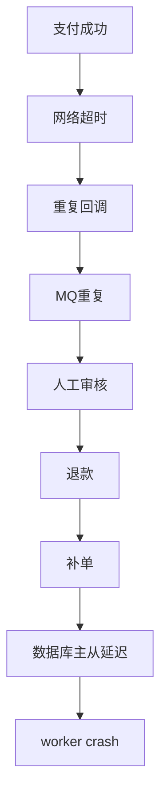
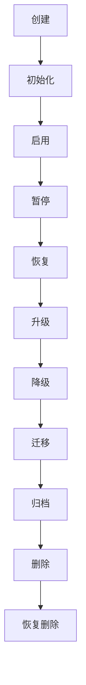
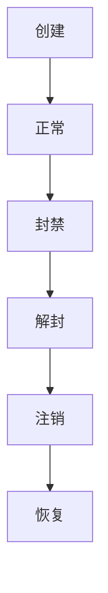
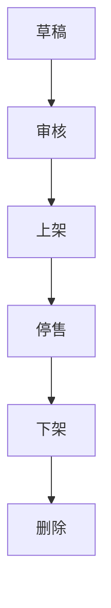
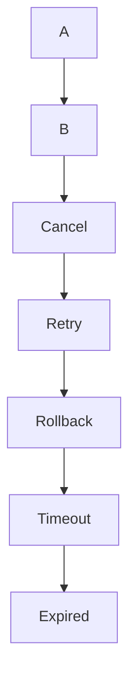
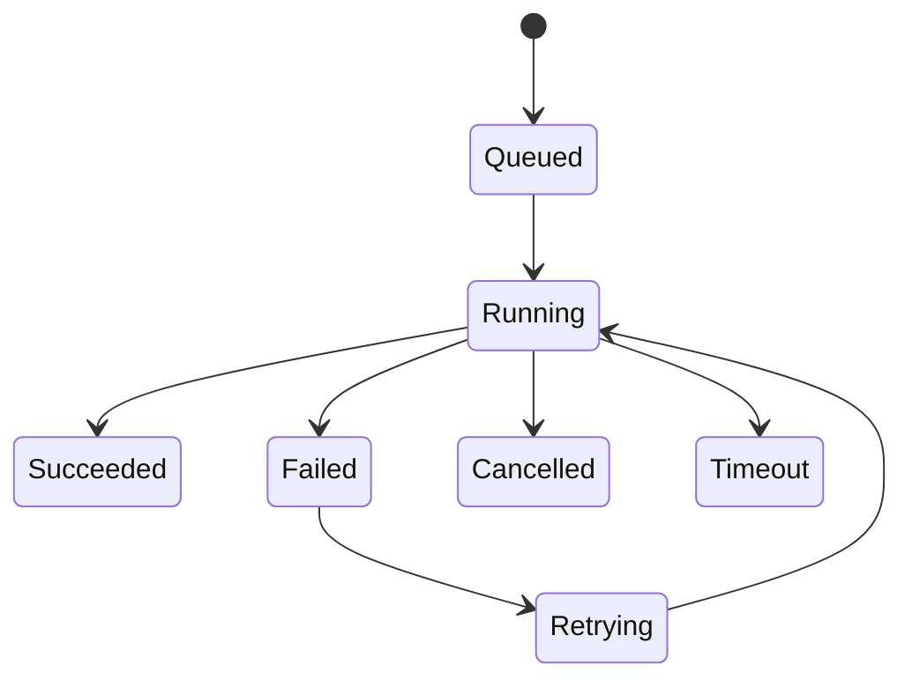
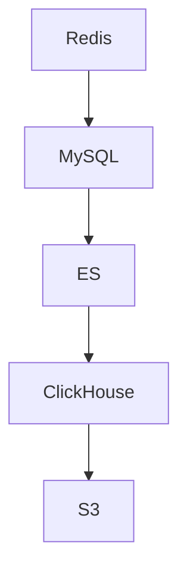
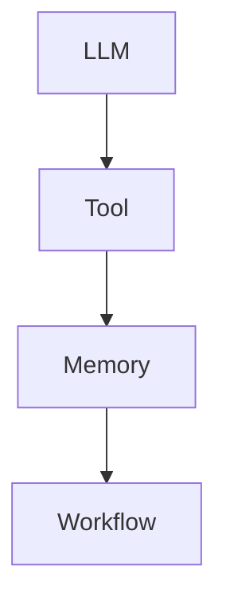
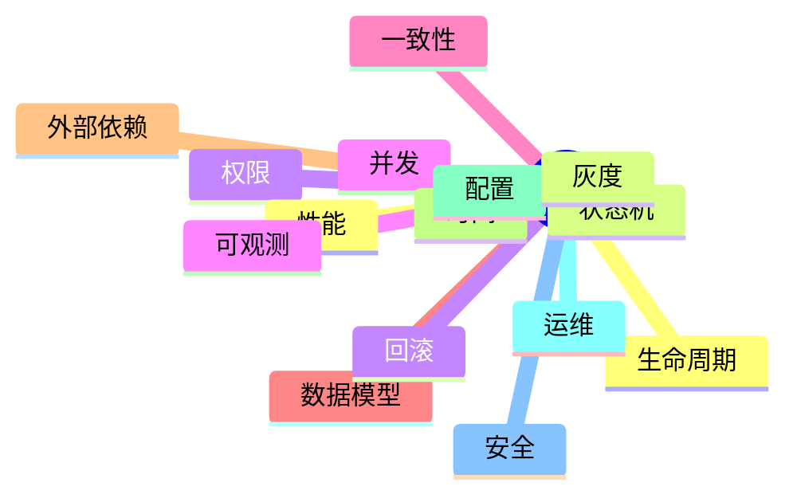

## Agent实现问题

> 更新时间：20260707  
> 版本：v0.0.1 : 资金、权益安全方面

目前agent都能力确实很强，但是还是有很多经典的问题无法处理
需要我们在spec/design阶段增强一下约束

ps：这里就不得不冒昧的评价一嘴，一些外行人，觉得ai写出来能跑就行了
科班都经常会看高并发问题、性能问题
很多情况和bug，你感觉是人写的有问题；很多是类似的异常情况没有考虑的，问题始终是无穷无尽的；

## 最经典的一些

| 类别 | 典型问题 |
| --- | --- |
| 并发幂等问题 | 扣款、返佣、结算必须得有唯一的幂等键；事务也得有边界；锁的顺序；唯一索引问题 |
| 金额安全 | 金额不能为负数；金额为0怎么处理；价格缺失/新旧数据 |
| 失败回复 | hook失败；死信和context关系（是否独立）；补偿失败如何重试 |
| 状态机 | 状态是否丢失；文档如何维护状态机以及核心链路的文档 |
| 数据约束 | DB唯一约束；CHECK约束；索引 |

因此我们在spec和design的时候就要考虑清楚：

很多的边界说实话，PM基本不会给出，拿到很多的需求和prd我都要和他们再进一步的确认这个边界情况和逻辑情况（其实我一直在想这种问题还得我研发去给你们考虑清楚么，你这个需求A和需求B会导致出现一个需求C，卡在A-B中间某个特殊状态，一开始设计的时候就真的没有考虑过？）

## PM视角 vs PE视角

其实我们视角是完全不一样的

| 角色 | 视角 |
| --- | --- |
| PM | 用户点击商品-查看-购买-代理/sub-返佣 |
| PE | 支付成功 → 网络超时 → 重复回调 → MQ重复 → 人工审核 → 退款 → 补单 → 数据库主从延迟 → worker crash |

## CPS分销、裂变示例

比如常见的CPS分销，裂变
在佣金的分享和建立的时候

我们不能只是简单的写成：

> “订单结算完成后生成唯一的返佣记录”

而是完整描述对象、逻辑判断、细节描述：

> “同一订单、同一代理、同一返佣层级、只能生成一个返佣集的记录

这个约束靠什么约束（数据库唯一索引），而不是只是select来进行判断记录
返佣的金额必须>=0
订单进入settled（已完成）之后，无论是自动支付还是人工审核还是补偿任务，都应该触发统一路径，但是对应的来源（触发方式）要分级，在domain层这里进行采用枚举的方式增设

## 资金相关

资金相关（不做好这个安全，小心小命不保）

> 钱包、返佣、库存、兑换码、结算

常见的相关问题如下：

| 问题 |
| --- |
| 幂等键如何设置 |
| 唯一约束如何设置 |
| 并发重复请求如何处理 |
| tx commit后的副作用如何保证不丢失 |
| worker重试是否会导致重复 |
| 失败后能否补偿，如果补偿也失败会怎样 |

设计这几个问题，建议对应的涉及到资金、权益等的spec内容当中,增设一下以下内容

| Spec/Design章节 | 内容 |
| --- | --- |
| Business Invariants | 业务不变量 |
| State Machine | 状态流转与所有入口路径 |
| Transaction & Idempotency | 事务边界、幂等键、唯一约束 |
| Failure & Retry | 失败、重试、死信、补偿策略 |
| Data Compatibility | 旧数据、迁移、默认值、空值处理 |
| Concurrency Risks | 并发写、锁、TOCTOU、worker 多实例问题 |

## 经典问题清单

经典，尤其资金、订单、库存、返佣、兑换码系统里特别容易漏：

| 类别 | 典型遗漏 |
| --- | --- |
| 幂等 | 支付回调重复、用户重复点击、worker 重试、MQ 重投导致重复发货/返佣 |
| 事务边界 | DB 成功但消息没发；消息发了但 DB 回滚；跨服务调用夹在事务中 |
| 状态机 | 取消后又支付成功；退款中又发货；人工审核、补单、后台修改绕过主流程 |
| 金额精度 | float 算钱；分/元混用；四舍五入不一致；负数金额；优惠券导致利润为负 |
| 旧数据兼容 | 新字段默认 0 被当成有效值；历史订单缺快照；迁移脚本没补齐 |
| 唯一约束 | 只靠代码查重，没有 DB unique；软删除后 unique 失效；多租户漏 tenant_id |
| 并发库存 | 超卖；扣库存成功但订单失败；库存补偿失败；预占库存过期未释放 |
| 退款/撤销 | 返佣已发后订单退款；部分退款怎么扣回；代理余额不足无法冲正 |
| 限额风控 | 日限额事务外查询；多实例突破限制；Redis 计数与 DB 状态不一致 |
| 权限越权 | 代理只能看自己的订单；管理员多租户隔离；接口只前端隐藏没后端校验 |
| 审计日志 | 改价格、调余额、审核订单无操作日志；无法追责和回滚 |
| 时间问题 | 时区错误；自然日/UTC 日混用；月结跨月；定时任务重复跑/漏跑 |
| 重试风暴 | 下游失败时无限重试；无退避；无熔断；把 503 放大成雪崩 |
| 死信处理 | 失败事件没有落库；DLQ 没人消费；重放事件会重复执行 |
| 配置风险 | 线上默认配置不安全；开关没灰度；配置变更无审计/回滚 |
| 观测缺失 | 没有金额差异监控；没有 pending 卡死监控；没有库存不一致监控 |
| 安全问题 | 兑换码可枚举；签名不校验；回调来源不验；敏感日志泄露 |
| 批处理问题 | 分页漏数据；边扫边改导致跳页；大事务锁表；worker 多实例重复处理 |
| 缓存一致性 | 价格、库存、余额缓存未失效；读缓存写 DB 导致脏数据 |
| 边界值 | 0 元订单、超大金额、负利润、空代理、循环邀请、自己邀请自己 |

## 后续

- 在prd 转化为spec中间
- 我们要设置一个专门的 Architecture Agent 进行 Architecture Review（补充研发人员）
- 找出所有 Happy Path 之外的状态，以及这些状态下系统是否仍然满足业务不变量。

## 其他方面

未来补充，达到一定的量级可以整合的时候再继续补充进来。

### 生命周期设计

对于PM或者老板的需求，他们提供的往往都只有“创建/使用” 就完事了
然后对于你，研发，你应该考虑

不然

- 出事故怎么处理？如何止血
- 后期我们这个要下线了，换一个
- 我要升级B方案，不行，换回A方案
- 这个我要去掉

### 常见生命周期示例

常见的这个生命周期，我们以用户状态和商品状态为例

| 对象 | 生命周期 |
| --- | --- |
| 用户账号 | 创建 → 正常 → 封禁 → 解封 → 注销 → 恢复 |
| 商品 | 草稿 → 审核 → 上架 → 停售 → 下架 → 删除 |

### 状态机设计

PM给我们A-B
我们这里设计要考虑

比如现在很多常见涉及到算力资源，比如这里供应商提供的token没了，或者资源有限，要进入排队了

### 数据一致性问题

数据一致性

例如：

| 问题 |
| --- |
| 更新顺序？ |
| 失败怎么办？ |
| 部分成功怎么办？ |
| 缓存什么时候失效？ |
| 索引什么时候同步？ |

这是互联网最经典的问题之一。

### 时间/定时

| 时间/定时问题 |
| --- |
| 数据库是否设置时区 |
| 自然日 |
| 24 小时 |
| 工作日 |
| 月底 |
| 闰年 |
| DST（夏令时） |
| 定时任务 |
| 重复执行 |

### Agent业务

AI Agent（你以后最容易踩）

这是最近两年最典型的。

例如：

容易漏：

| Agent经典问题 |
| --- |
| Prompt Injection |
| Tool 无限循环 |
| Memory 污染 |
| Token 爆炸 |
| Context 超长 |
| 模型降级 |
| Tool Timeout |
| MCP 挂了 |
| 多 Agent 死循环 |
| Planner 不收敛 |

这些 PM 基本不知道。

### 业务角度

啊，不会吧，难道我们真的要考虑那么复杂么！
看钱而定吧！

## 注意

基本做到这些就可以了，基本的厂商都有自己的基建+测试的；很多东西都是套用即可；

| 能力 | 说明 |
| --- | --- |
| 可恢复性（Recoverability） | 任何任务、订单、返佣、Agent Workflow 在任意一步失败后，是否可以安全恢复，而不是只能人工修数据？ |
| 可观测性（Observability） | 如果用户说“昨天少了一笔返佣”“Agent 为什么回答错了”，能否通过日志、事件链路和指标快速定位原因？ |
| 可演进性（Evolution） | 以后增加三级返佣、更多支付渠道、新 Agent、新模型时，现有设计是否需要大改，还是可以平滑扩展？ |
