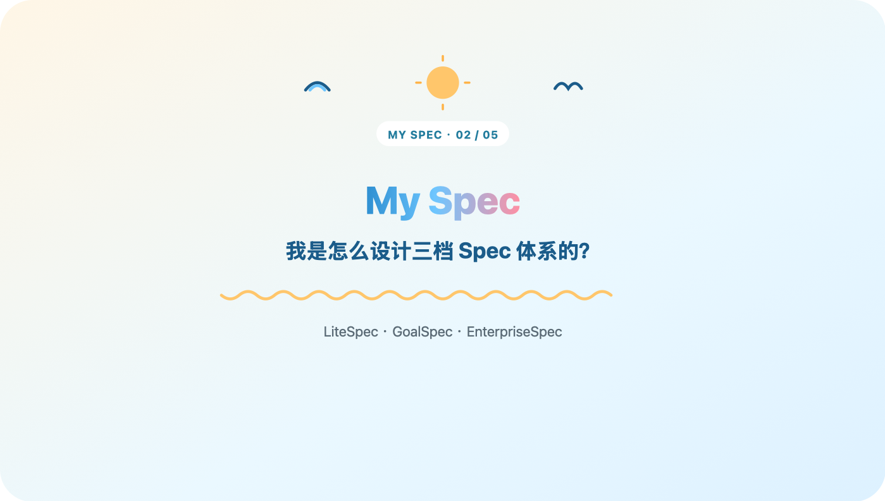
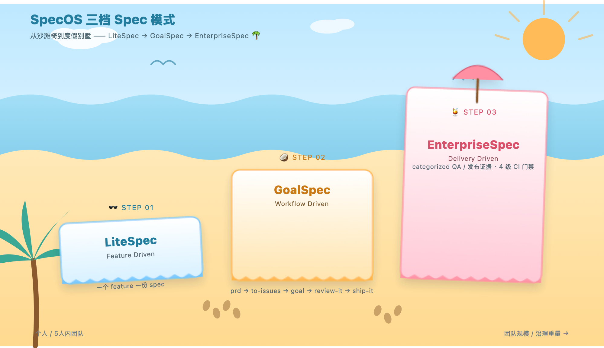

# 我是怎么设计三档 Spec 体系的？

上一篇讲了我为什么放弃 openspec、自己捣鼓了三档 spec：LiteSpec、GoalSpec、EnterpriseSpec。这篇接着讲，这三档到底怎么分出来的，什么时候该从一档升到另一档。

上周有个朋友接了个私活，问我能不能把这套 spec 直接甩给他用。我说行啊，把 LiteSpec 那套模板发过去了。

结果他用了没两天就来找我吐槽——项目里多了个合作的人，两个人对着同一份 feature spec 改来改去，谁改了哪块、改完了要不要通知对方，全靠微信喊话。喊漏了一次，两人各写了一版冲突的实现，返工大半天。

吃过的亏

我这才反应过来，我把"给一个人用的工具"直接甩给了"两个人的团队"，出问题不怪他，怪我没提前说清楚。这套东西压根就不是一刀切的。

回头看自己踩过的路，其实每次项目"长大"，压力点都不一样。一个人写代码的时候，最大的敌人是自己健忘，spec 只要能帮我记住"这个 feature 当初为什么这么设计"就够了，流程越轻越好，写多了反而没人看。我甚至试过反过来的坑——有阵子图省事，把 EnterpriseSpec 那套重流程用在一个人的小项目上，结果每次改一行代码前都要先填一堆证据字段，写 spec 的时间比写代码还长，两周之后彻底放弃，宁可什么都不写。

"

太重和太轻，其实是对称的两种失败，这个我是真吃过亏的。

多个人一起改同一个东西的时候，敌人变成了"信息没对齐"——谁都以为自己知道最新状态，其实谁都不知道。这时候需要的不是更详细的 spec，是一套大家都得走一遍的流程，把"对齐"这件事从靠喊话变成靠规则。

到了牵扯支付、权限这种"改错要担责"的功能，敌人又变了——出了事说不清楚。光对齐还不够，得留痕，得证明每一步都测过审过。

所以我没打算做一套放之四海而皆准的 spec，而是做成了三档，跟着项目的实际压力一档一档往上升。

**LiteSpec（Feature Driven）**：一个 feature 一份 spec，写给未来的自己看，优化的就是一个人写代码时的效率，别的什么都不图。默认走这一档，不折腾，token 花得最少，学习成本几乎为零。缺点是没有强制对齐机制、没有分类归档的证据——但这些缺点在一个人的场景里压根不算缺点。

**GoalSpec（Workflow Driven）**：核心不是文档变厚了，是多了一套所有人都要走一遍的六步闭环——提需求，拆成设计，拆成可执行的 issue，动手实现，找人评审，最后交付。这六步串起来才是真正的价值：不是让 spec 写得更细，是让"对齐"这件事有了固定动作，不用再靠一个人在群里喊"我改到哪了啊"。走完这六步，每个环节的产出物都留在固定位置，下次想知道这功能当初怎么定的，顺着链条一路能翻回去，不用再去问人。

**EnterpriseSpec（Delivery Driven）**：目标换成审计和治理的质量。到这一档，光说"我改完了"没用，得拿出证据链——改了什么、怎么实现的、怎么测的、谁审的、怎么安全上线、出事了怎么回滚，一条都不能少。学习成本最高，token 花得最多，但换来的是出事能立刻查到是哪一环，这笔账在核心业务上是划算的。

三档摆一起看，是一张随治理强度递增的台阶：目标从效率到可复用闭环再到审计质量，协作规模从一个人到小团队再到多团队，token 成本和学习成本也一路走高。没有哪一档天然更好，只有合不合当前项目的胃口。

那什么时候该升级呢？朋友那次事故给了我一个挺具体的信号：**当"谁改了什么"这件事开始需要靠人和人互相通知的时候，就该从 LiteSpec 升到 GoalSpec 了**。不是人数到某个数字才升级，是对齐成本先冒头了——哪怕只有两个人，只要开始出现"我以为你知道""你怎么没告诉我"这种对话，信号就已经很明显。

从 GoalSpec 升到 EnterpriseSpec，我目前的判断是：当一个改动"改错了要有人负责"的时候——支付链路、权限校验、用户数据，哪怕团队还是三五个人，也该上这一档。是风险等级在推着升级，不是团队规模。我给自己定的粗略标准是：这功能出了问题，会不会有人在深夜被电话叫起来处理，会的话别犹豫，直接上 EnterpriseSpec。

反过来，降级同样重要，只是很少有人愿意主动降。一个功能从核心链路降级成边缘维护之后，还硬扛着 EnterpriseSpec 那套证据链，纯粹是在浪费 token 和耐心。我现在的习惯是隔一阵子回头看一眼，问自己这玩意儿现在还配得上它现在的档位吗。

不管走到哪一档，有个原则我一直没松口：不改变用户已有的使用习惯，不额外教育用户。升级到 GoalSpec 意味着多了流程，但流程要嵌进大家已经习惯的动作里——提需求还是提需求，写代码还是写代码，只是这些动作背后多了一套固定的产出物规范，而不是逼着所有人先学一套新范式再干活。个人客制化则完全放开，现在 agent 能力足够强，按具体场景微调，成本真不高。

三档这个设计本身不难，难的是每一档背后其实站着一支不一样的"打工人小分队"在干活——LiteSpec 靠我自己，GoalSpec 靠六步闭环里那几个角色分工，EnterpriseSpec 靠更严格的审查链条。这批 agent 到底怎么分的工、会不会重复造轮子，还没细说，下一篇打算专门聊聊。

