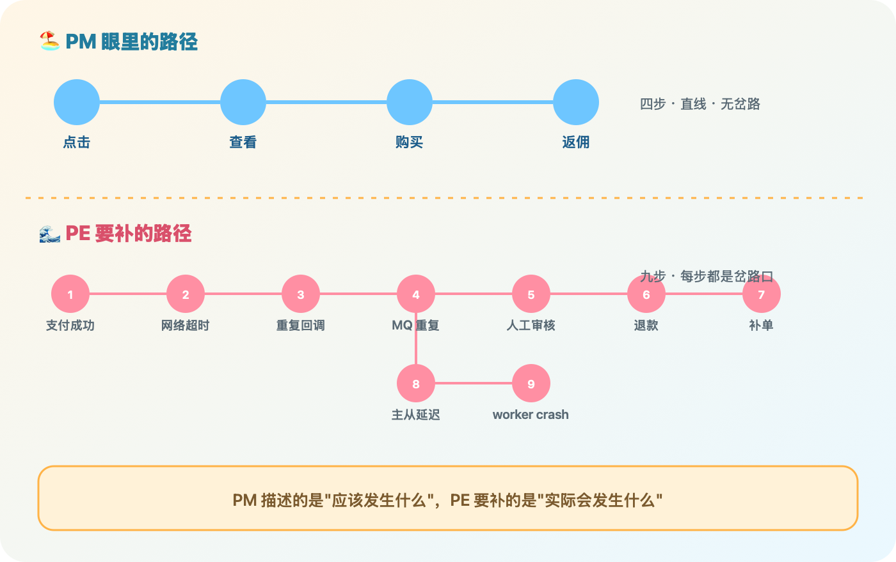

# Spec 注意的点，生产的坑

这是"My Spec"系列第五篇，也是收尾篇。前四篇分别讲了三档 spec 怎么分、agent 怎么用共享骨架组织起来、CI 门禁怎么设计。写到这儿，如果只讲"我搭了什么"，这个系列就有点像产品发布稿了——实际情况不是这样，这篇想认真讲讲哪些地方到现在还是坑，尤其是流程都对了、内容照样能出事的那部分。

有个返佣需求，PM 给的描述就一句话："订单结算完成后生成唯一的返佣记录。"我拿着这句话去写 spec，写到一半发现自己没法往下写——同一个订单，退款了怎么办？人工审核和自动结算都能触发结算，会不会各生成一条？一层层追问下去，PM 大多答不上来，只能说"你看着办"。我一边追问一边心里犯嘀咕，这种边界条件，真的该是我一个研发去帮他们想清楚吗？

后来想明白了，这不是 PM 偷懒，是我们俩看的压根不是同一个东西。

"

PM 描述的是"应该发生什么"，PE 要补的是"实际会发生什么"。

这才是 spec 最容易被漏掉的地方——不是记性不好忘了写，是视角一开始就不完整。中间那一大截异常分支，spec 阶段没人主动去想，就只能等生产环境自己把它挖出来，代价通常是一次真实的事故。

前面几篇聊的都是"怎么组织"的坑——三档怎么分、agent 怎么协作、CI 怎么拦人，解决的是 spec 能不能被好好维护的问题。但哪怕流程全部到位，spec 里的内容本身写得太糙，照样白搭。同样是那条返佣规则：

糙写法 ❌

订单结算完成后生成唯一的返佣记录。

能落地的写法 ✅

同一订单、同一代理、同一返佣层级，只能生成一条返佣记录，靠数据库唯一索引兜底，不能只靠代码 select 判断；金额必须 ≥ 0；无论自动支付、人工审核还是补偿任务触发，都要走同一条结算路径，触发来源分级记录。

前后两种写法字数差不多，但后一种才真正能挡住并发重复、金额为负、审核和自动路径打架这几类经典事故。

想清楚这一层之后，我给涉及资金、权益的 spec 额外定死了几个必填章节，不写不让过：

| 必填章节 | 要回答的问题 |
|---|---|
| 业务不变量 Business Invariants | 什么情况下无论如何都不能发生 |
| 状态机 State Machine | 状态流转和所有可能进入这个状态的路径，不只是 happy path |
| 事务与幂等 Transaction & Idempotency | 事务边界、幂等键、唯一约束 |
| 失败与重试 Failure & Retry | 失败之后怎么重试、死信怎么处理、补偿失败了怎么办 |
| 数据兼容性 Data Compatibility | 旧数据、迁移脚本、默认值、空值怎么处理 |
| 并发风险 Concurrency Risks | 并发写、锁的顺序、多个 worker 实例同时跑会不会打架 |

配合这几个章节，我自己整理了一份"经典问题清单"，写 spec 之前先对照一遍，有点像开发版的检查清单，专挑资金、订单、库存、返佣这类系统里最容易漏的地方：

| 类别 | 具体坑 |
|---|---|
| 幂等 | 支付回调重复、用户重复点击、MQ 重投导致重复发货 |
| 事务边界 | DB 成功但消息没发出去 |
| 状态机 | 取消后又支付成功、退款中又发货 |
| 金额精度 | 用 float 算钱、分和元混用 |
| 旧数据兼容 | 新字段默认值被当成有效值 |
| 并发库存 | 超卖、扣库存成功但订单失败 |
| 权限越权 | 接口只在前端隐藏、后端没校验 |
| 审计日志 | 改价格没留操作记录，出事没法追责 |

这份清单还在不断长，说实话可能永远也列不完。

这些经典问题是这几年做业务系统攒下来的，但这两年多了一类新坑，是 PM 完全想不到、只有真正跟 agent 打交道才会撞上的：

Prompt Injection
Tool 无限循环
Memory 被污染
Token 爆炸
Context 被截断
模型被动降级
多 agent 互等死锁
Planner 发散不收敛

这些坑不写进 spec，agent 自己是不会主动告诉你它正在掉进去的。

清单不可能穷尽，我给自己留了一条更省心的判断线，不管清单加到多长，最后落到三件事上：

🔧

能自动恢复

而不是只能人工修数据

🔍

能马上定位

顺着日志和链路找到原因

🧱

不用推倒重来

加新玩法时现有设计扛得住

基本做到这三条，其他细节可以随项目实际情况取舍——到底要抠多细，说到底还是看这个功能背后压着多少钱、多少责任。

系列收尾，诚实交代

除了这份内容层面的坑清单，流程层面还有几处一直没让我满意的答案：EnterpriseSpec 那一档的证据链没跑出完整闭环；CI 门禁的规则写完了、本地能跑通，但还没真正接进自动化流水线；这套体系目前基本是我一个人在维护和使用，真正拿到多人协作场景里跑一圈会撞上什么，我心里也没底。这套体系目前能帮我省下来的，是"记性不好"和"重复劳动"这两件事；帮不了我的，是"没有足够多的实践把它跑坏、再修好"这件事，这个恐怕只能靠时间去填。

比起把这套东西讲成一个已经完工的产品，我更想诚实地说：它现在就是我自己每天在用、每天在改的一套工作方式，坑清单也还在长。不知道大家手头那些"看起来跑起来了、其实没人敢细看"的东西，是不是也藏着类似没写进 spec 的异常分支——如果有，倒是挺想听听你们是怎么发现的。系列先写到这儿，后面攒到新东西再接着聊。

