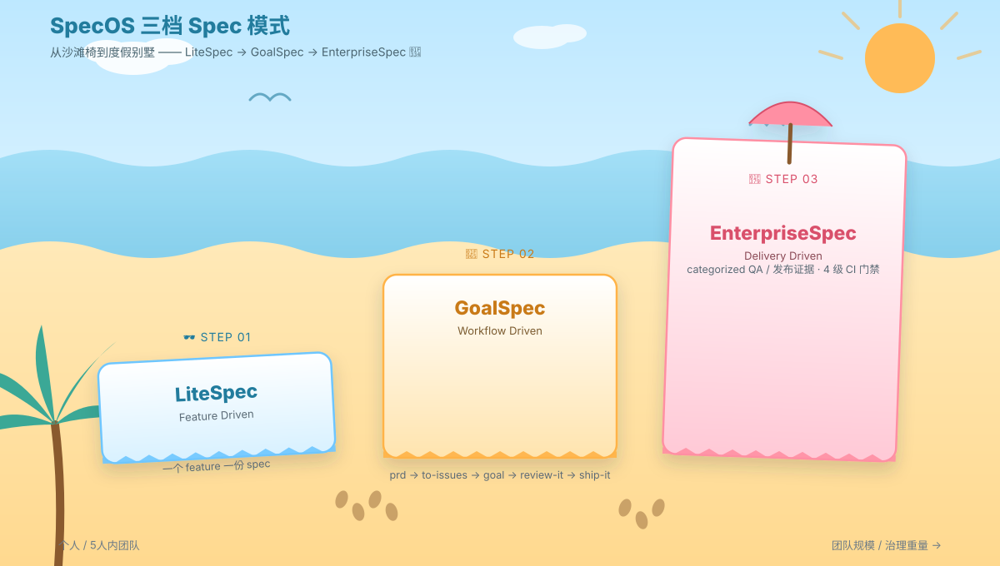
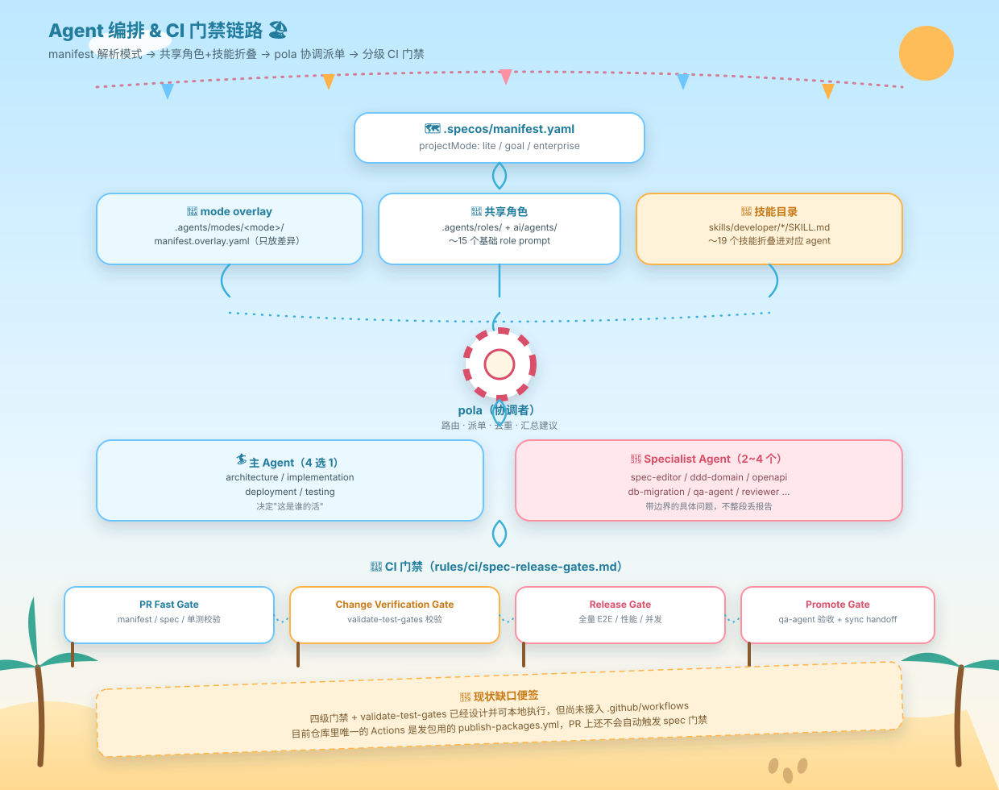

# 救命！在被 AI 卷成八爪鱼之前，我先给自己搓了一套"作弊小抄"

最近这阵子，vibe coding 是真的有点野。一句话丢给 AI，唰一下就给你生成一坨代码，跑起来了——但你要问它内部到底怎么实现的？说不清楚，反正先跑起来再说，跟开盲盒差不多。

不过真正扛不住的，不是 AI，是我自己。

一个人手上同时开好几个项目，脑子根本不够用。AI 倒是不嫌上下文长，累的是我这个肉身——每次切回一个项目，都要花半天回忆"这玩意儿当时到底是咋设计的、上次为啥这么改"。

于是就有了今天要聊的东西：**spec 体系**。

## spec 是什么？说白了就是"小抄"

前面几次谈过，团队开发的话大家一般会想到 openspec——把项目的上下文，按规矩写成文本存到一个目录里。以后 AI 不用把所有代码都读一遍，扫一眼这份"小抄"就知道现在项目长啥样。

思路是真的好，但是……**openspec 也太重了**，流程一多我自己都不想维护，更别提坚持了。

一份没人维护的 spec，比没有 spec 还可怕——它会带着"过期的谎言"，让 AI 理解错、瞎改一通，那才是真的要命，毕竟现在这压力，我可不想被优化掉😭

所以我照着自己的开发节奏，抄了个"减配增强版"，现在这套体系已经落地了三档：

## 三档小抄：从"自己玩"到"要交代"

想象一下，你的项目是从一个人的草台班子，慢慢长成要对甲方交代的正规军——治理成本是一路爬楼梯往上走的：

- **LiteSpec**：一个 feature 一份小抄，个人爽玩、五人以下小团队都能直接抄作业，token 花得最少，上手成本最低。
- **GoalSpec**：当团队开始固定走 `prd → prd-to-spec → to-issues → goal → review-it → ship-it` 这套六步闭环的时候升级到这档——相当于给"随手改改"加了个"提交前先审一遍"的仪式感，但还不用整那些审计报告。
- **EnterpriseSpec**：涉及支付、权限、合规这种"改错了要坐牢"级别的功能，就得上这档——QA、审计、发布证据全都要留痕，毕竟出了事总得有人能"快速抢救"。

三档不是三选一，是随着项目长大自然升级的台阶，跟老板画饼一样，越到后面越"卷"。

## 核心：给每一档配一支"打工人小分队"

这才是整套体系里我最得意的部分。

每一档 spec，我都配了一份 agent 花名册，外加各种 skill（技能包），把技能塞进对应的 agent 里干活；再加一层"模式定制"——同一批打工人，接到不同项目档位的活儿，只需要换一套"补充须知"，不用把说明书整个重写一遍。

具体咋分工呢：

- 有个总协调（内部代号 `pola`），专门负责接活儿、派单、把重复和"假警报"筛掉，最后就给你一条能直接执行的建议——不用你自己从一堆 agent 报告里大海捞针。
- 干活的分两层：一个"主力 agent"（架构/实现/部署/测试，四选一）扛主责，再配 2~4 个"专精小弟"（比如专管数据库迁移的、专管 API 契约的、专管验收的）各答各的那道题，绝不越界抢活。

然后是重头戏——**CI 门禁**。

我给每一档都设计了对应的门禁关卡，从"PR 快速检查"一路到"发布前终审"，一共四道关卡，专门检查 spec 有没有及时更新、内容对不对得上。会多花点 token，但对一个要长期维护的项目来说，这钱花得值——不然真出事的时候，翻旧账都不知道从哪翻起。

**说句实话**：这四道门禁目前设计和本地命令都齐活了，但还没真正接进 CI 流水线自动跑——算是"知道要抢救、但救护车还在路上"的阶段，我也还在推进。诚实交代，不画饼。

## 用起来图啥？简单，别折腾我

体验上我就一个诉求：**别改变我的使用习惯，也别教育我**。用大家已经习惯、乐意用的方式去用它，而不是逼自己适应一套新范式。

至于客制化——现在 agent 能力这么强，想根据自己的场景魔改，真的很方便。这也是我为啥宁愿自己写一套，也不直接套 openspec：**我得对它有维护的意愿**，不然 spec 荒废的那一天，才是真正的地狱开始。

写到这，也是说给自己听：卷是卷不完的，但至少别让自己第一个绷不住。
